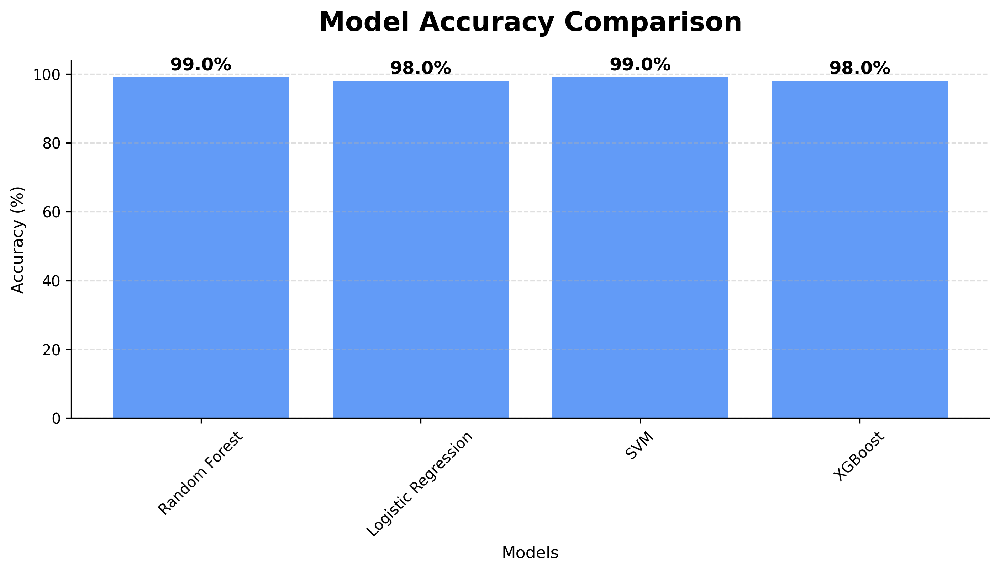

# Clinical AI Cancer Audit System


## Overview
This application is a professional clinical decision support system designed for high-dimensional cancer risk classification using biomarker panels. It integrates advanced machine learning algorithms with explainable AI (XAI) and topological data analysis to provide clinicians with a robust, real-time diagnostic auditing tool.

The system processes 61 unique biomarkers per patient to distinguish between healthy and high-risk populations, offering deep insights through feature importance analysis and patient similarity mapping.

## Key Features
- Multi-Model Diagnostic Engine: Concurrent evaluation using Random Forest, SVM, XGBoost, and Logistic Regression.
- Explainable AI (XAI): Global and local feature importance via SHAP values to explain individual risk scores.
- Patient Similarity Audit: 2D topological mapping using t-SNE to visualize patient clustering in biomarker space.
- Precision-Recall Triage: Dynamic threshold analysis to optimize clinical sensitivity and specificity.
- Graph Neural Network (GNN): Experimental structural analysis of biomarker metabolic pathways.
- Real-Time Analytics: High-speed inference (under 11ms) suitable for live laboratory integration.

## Prerequisites
- Python 3.10 or higher.
- System RAM: 4GB minimum (8GB recommended for SHAP analysis).
- Operating System: Windows (Optimized for standard clinical workstations).

## Installation

### 1. Clone or Extract the Repository
Ensure the project files are located in a dedicated directory on your system.

### 2. Set Up a Virtual Environment (Recommended)
Open a terminal in the project directory and run the following commands:
```bash
python -m venv venv
venv\Scripts\activate
```

### 3. Install Required Libraries
Install the core dependencies using the following commands. Ensure you follow the specific instruction for PyTorch to allow CPU optimization.

```bash
pip install pandas numpy scikit-learn matplotlib seaborn openpyxl umap-learn scipy psutil joblib
pip install torch --index-url https://download.pytorch.org/whl/cpu
pip install xgboost torch_geometric
```

## Software Components
The application is structured into modular controllers and logic managers:
- controllers/: Handles data flow between the UI and backend logic.
- logic/: Contains the ModelManager (AI engines) and DataManager (cleaning/validation).
- ui/: Contains the dashboard components, sidebar navigation, and styling logic.
- views/: Stores the persistence layers, including trained models and saved visualizations.
- utils/: Common utilities for asynchronous execution and error handling.

## Execution
To launch the clinical dashboard, execute the main system entry point from the root directory:

```bash
python main.py
```

## Clinical Data Requirements
The system expects an Excel file (.xlsx) with a sheet named Training_Data.
- Column sample_id: Unique patient identifier.
- Column cancer_risk_class: Optional (auto-generated via K-Means if missing).
- 61 Biomarker Columns: Numeric laboratory values.

## Methodology Summary
The system utilizes a comparative audit framework. It first discovers risk signatures through unsupervised K-Means clustering and validates them using t-SNE topological mapping. Predictive modeling is performed using an ensemble of supervised algorithms validated via 5-Fold Stratified Cross-Validation to ensure diagnostic stability.
